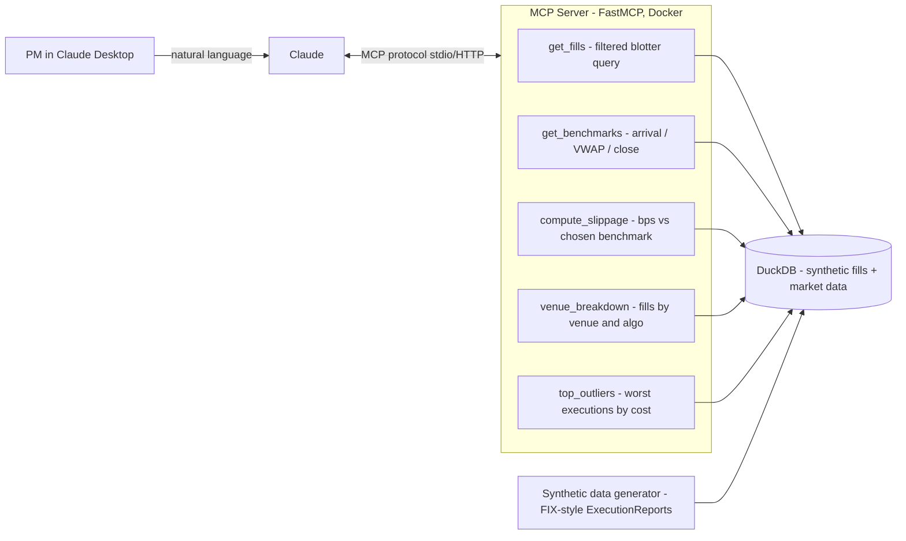

# Project 3: Execution Quality Copilot (TCA-over-MCP)

> **Portfolio Project:** AI-PM Learning Portfolio (MCP Track)
> **Monorepo path:** `ai-pm-portfolio/execution-quality-copilot/`
> **Status:** Scoped — 2026-06-11

---

## Problem Statement

Hedge fund PMs and execution traders receive Transaction Cost Analysis (TCA)¹ as static, lagging PDF reports — often produced by the very brokers whose execution is being graded. Answering a simple question like *"which broker algo cost me the most slippage on small-cap names last month?"* means raising a request to a quant/data team and waiting days. The data exists in the fund's own fill records; the bottleneck is access, not analytics.

## Proposed Solution

Build a **custom MCP server** that exposes the fund's execution data (trade blotter, fills, benchmark prices) as *tools* that Claude can call. The PM asks questions in natural language in Claude Desktop; Claude decides which tools to invoke, pulls exactly the data needed, computes slippage vs benchmarks, and answers with numbers and caveats.

**The key conceptual shift vs Projects 1 and 2:** in P1 (RAG) you pushed documents *into* the model's context; in P2 (LangGraph) you orchestrated the model through a fixed graph. Here, the model itself *decides* what data to fetch by choosing tools — and your job as the builder is **tool design**: what tools to expose, how to name/describe them, what guardrails to put on them. This is the same discipline as designing a FIX order-entry API: the spec you publish determines what counterparties can and cannot do. MCP is that spec, for LLMs.

## Architecture



**Design rule (your pre-trade-risk instinct applies):** tools are read-only, return bounded result sets (max-row caps), and never expose raw SQL — Claude composes *tools*, not queries. This is the LLM equivalent of giving a client DMA access with collar checks rather than a direct exchange session.

## Tech Stack

| Layer | Choice | Why |
|---|---|---|
| MCP server | **Python MCP SDK (FastMCP)** | The official way to build tool servers; the core new skill (Tracker: MCP Servers ⬜ → ✅) |
| Storage / analytics | **DuckDB** | In-process OLAP — ideal for slicing fills by venue/algo/symbol; zero infra; new vs P1's pgvector and P2's SQLite |
| Data | Synthetic generator producing FIX-style ExecutionReports (35=8) | Leverages your FIX expertise; no real trading data → no compliance risk |
| LLM client | Claude Desktop / Claude Code as MCP client | No UI to build — the chat client IS the UI; teaches you the MCP client/server contract |
| Packaging | **Docker** | One-command run (`docker run`); fills the Deployment tracker gap |
| Evals | Tool-use eval harness: golden Q&A set scored on (a) correct tool selection, (b) correct parameters, (c) numeric accuracy of final answer | Third eval style in the portfolio: P1 = retrieval evals, P2 = structured-output evals, P3 = **agentic tool-use evals** |

## New Skills This Project Introduces

- **Building an MCP server** — tool definitions, schemas, descriptions-as-prompts, stdio vs HTTP transport (Tracker: MCP Servers ⬜ → ✅)
- **Tool design for agents** — granularity, naming, guardrails; the #1 differentiator between toy and production agent systems
- **Docker packaging** (Tracker: Deployment ⬜ → ✅)
- **DuckDB** for analytical workloads
- **Tool-use evals** — measuring *did the model call the right tool with the right arguments*, a different axis from answer quality

## GitHub Repo Structure

```
execution-quality-copilot/
├── README.md
├── Dockerfile
├── pyproject.toml
├── .env.example
├── server/
│   ├── main.py              # FastMCP server entrypoint + tool registry
│   ├── tools/
│   │   ├── fills.py         # get_fills, venue_breakdown
│   │   ├── benchmarks.py    # get_benchmarks
│   │   └── tca.py           # compute_slippage, top_outliers
│   └── db.py                # DuckDB connection + bounded-query helpers
├── data/
│   ├── generate_fills.py    # synthetic FIX ExecutionReport generator
│   └── seed.duckdb          # pre-built sample dataset (10k fills, 50 symbols)
├── evals/
│   ├── golden_questions.json  # 15 PM questions + expected tools/params/answers
│   └── run_eval.py            # tool-selection accuracy + numeric-answer checks
└── docs/
    └── tool-design-notes.md   # your design rationale — gold for PM interviews
```

## MVP Scope (Week 1–2)

1. Synthetic data: 10k equity fills across 50 symbols, 4 brokers, 3 algos (VWAP/TWAP/IS), with arrival/VWAP/close benchmark prices.
2. MCP server with the 5 tools above, running locally over stdio, registered in Claude Desktop.
3. Demo transcript: 5 PM questions answered end-to-end (e.g. "rank my brokers by implementation shortfall in May").
4. Eval harness: 15 golden questions, report tool-selection accuracy and answer accuracy.
5. Dockerfile so a reviewer runs it with one command.

## Stretch Goals

- Ingest real FIX drop-copy logs (parse 35=8 messages) instead of synthetic data
- n8n workflow: nightly job calls the server and emails a "worst 5 executions yesterday" digest (would also tick the Orchestration gap)
- Multi-asset: extend to futures fills with different benchmark conventions
- Anomaly flagging tool: statistical outlier detection on slippage distribution

## PM-Ready Framing (for portfolio)

> *"Designed and built an MCP tool server that turns a fund's execution records into a conversational TCA analyst — letting portfolio managers self-serve execution-quality questions that previously required quant-team requests. Defined the agent's tool contract (read-only, bounded, auditable) by applying pre-trade-risk-control principles to LLM tool access, and built a tool-use evaluation harness to measure tool-selection and numeric accuracy before release."*

Interview talking points: tool design as product surface; why read-only guardrails matter; how agentic evals differ from RAG evals; build-vs-buy vs broker TCA.

---

## Why this project (rationale)

- **Fills the two biggest tracker gaps** (MCP Servers, Deployment) while reusing nothing structural from P1/P2 — each project keeps introducing genuinely new concepts.
- **Real, conflicted-incentive problem:** broker-provided TCA is the classic "grading your own homework" issue; independent, on-demand TCA is something PMs actually want.
- **Maximum domain leverage:** FIX ExecutionReports, benchmarks, slippage, venue analysis — you can sanity-check every number the system produces, which makes your evals credible.
- **MCP is the highest-signal skill on the list right now** for AI PM roles — it's the emerging standard for how enterprises wire LLMs to internal systems.

⚠️ **Compliance note:** if you ever point this at real fills (even your own PA trades), treat the data as confidential — local-only storage, no cloud LLM calls without anonymisation, and check UBS personal-conduct policies first.

---

¹ **TCA (Transaction Cost Analysis):** measuring how well trades were executed vs benchmarks like arrival price or VWAP, expressed in basis points of slippage.
² **MCP (Model Context Protocol):** Anthropic's open standard letting LLMs call external tools/data through a defined client-server contract — "FIX protocol for AI tools."
³ **Implementation Shortfall:** total cost of a trade vs the price when the decision was made (arrival price), the benchmark PMs care about most.
