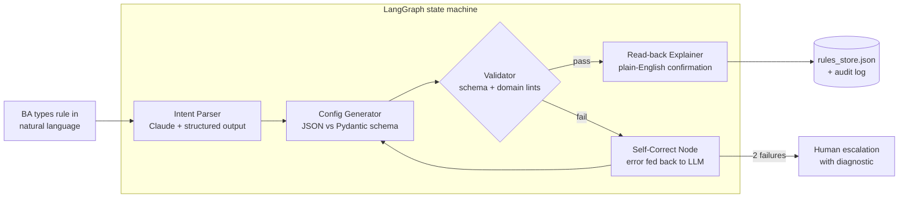

# Project: Pre-Trade Risk Rules Assistant ("RuleForge")

> **Portfolio Project #2:** AI-PM Learning Portfolio (Agent + Structured Output Track)
> **Repo path:** `ai-pm-portfolio/pre-trade-risk-rules-assistant/`
> **Status:** Scoped — 2026-06-11

---

## Problem Statement

When a desk wants a new pre-trade risk control ("block any single order > 5% of 30-day ADV on SGX small-caps"), a BA writes it in prose, a developer hand-translates it into config/code, and QA round-trips catch the inevitable mismatches — a days-long cycle for what is conceptually a one-line rule. RuleForge converts natural-language risk rule descriptions into **validated, schema-conformant JSON rule configs**, with an agent that checks its own output before a human ever sees it.

### Why this is a *real* problem
The NL → config translation gap is exactly where fat-finger config errors come from (wrong side, wrong scope, wrong threshold unit — bps vs %). Every e-trading shop you've worked with has a version of this pain.

---

## Proposed Solution

A **LangGraph agent** with a generate → validate → self-correct loop:

1. **Parse intent** — Claude extracts rule type, scope, threshold, action from free text
2. **Generate config** — emits JSON conforming to a strict Pydantic schema (rule types: order notional limit, ADV %, price collar, restricted list, position limit)
3. **Validate** — deterministic Pydantic validation + domain lint checks (e.g., collar % sane? scope exchange exists? units consistent?)
4. **Self-correct** — on validation failure, the error is fed back to the LLM for a retry (max 2 loops), then escalate to human
5. **Explain** — agent produces a plain-English read-back of the generated rule so the BA can confirm intent ("round-trip verification")

This is the LLM equivalent of pre-trade checks on the LLM's *own* output: the model is the trader, Pydantic is the risk gateway, and the self-correction loop is the reject/amend cycle.

---

## Architecture



Each box is a **LangGraph node**; the loop C→D→F→C is a conditional edge — this is the core new concept vs Project 1's linear RAG chain.

---

## Tech Stack

| Layer | Choice | Why |
|---|---|---|
| LLM | Claude claude-sonnet-4-6 (Anthropic SDK, tool use) | Native structured-output via tool calling; you used Claude via LangChain in P1 — now go direct to the SDK to see what frameworks abstract away |
| Agent framework | **LangGraph** | Stateful graph with conditional edges; the validate/self-correct loop is impossible to express cleanly in a plain chain |
| Schema/validation | **Pydantic v2** | Deterministic guardrail; the "risk gateway" for LLM output |
| Backend | FastAPI | `POST /rules/draft`, `GET /rules/{id}` — consistent with P1 |
| Storage | SQLite + JSON audit log | Zero-infra; audit trail mirrors real risk-system change logs |
| UI | Streamlit (reuse P1 patterns) | Rule input box, generated JSON, read-back panel, approve/reject buttons |
| Evals | **Custom eval harness** (exact-match + schema-conformance + LLM-judge for intent fidelity) | Structured output needs different evals than RAG — RAGAS doesn't apply here; this teaches you eval *design*, not just eval *running* |

---

## New Skills This Project Introduces

- **LangGraph** — first agent framework: state, nodes, conditional edges, cycles (Tracker: Agent frameworks ⬜ → ✅)
- **Structured output / tool use** — forcing JSON schema conformance via Anthropic tool calling
- **Self-correcting agent pattern** — generate → validate → retry loop with escalation (the #1 production agent pattern)
- **Custom evals for structured output** — field-level exact match, schema pass rate, intent-fidelity LLM-judge; contrasts with P1's RAGAS retrieval metrics
- **Direct Anthropic SDK use** — vs LangChain-wrapped calls in P1

---

## GitHub Repo Structure

```
pre-trade-risk-rules-assistant/
├── README.md
├── requirements.txt
├── .env.example
├── app/
│   ├── graph.py            # LangGraph definition (nodes + edges)
│   ├── nodes/              # parser, generator, validator, corrector, explainer
│   ├── schemas/rules.py    # Pydantic rule schemas (5 rule types)
│   ├── lints.py            # domain sanity checks beyond schema
│   └── api.py              # FastAPI endpoints
├── ui/streamlit_app.py
├── evals/
│   ├── golden_rules.json   # 40 NL descriptions + expected configs
│   ├── run_eval.py         # schema pass %, field accuracy, intent fidelity
│   └── results/
└── tests/                  # unit tests for validator + lints
```

---

## MVP Scope (Week 1–2)

- 3 rule types: **order notional limit, price collar, restricted list**
- LangGraph loop working end-to-end with max-2 retry + escalation
- Pydantic schemas + 5 domain lints
- 20-case golden dataset, eval script reporting schema-pass-rate and field accuracy
- Streamlit demo: type rule → see JSON + read-back → approve

**Definition of done:** ≥ 90% schema pass rate on golden set; ≥ 80% field-level accuracy first-pass (before self-correction); 100% after ≤ 2 corrections or escalated.

## Stretch Goals

- ADV % and position-limit rule types (require reference-data lookup → introduces a **tool-calling node** that queries a mock market-data table)
- Rule *conflict detection* — agent checks new rule against existing rules_store ("this duplicates/contradicts rule #12")
- **MCP server wrapper** — expose `draft_rule` / `validate_rule` as MCP tools so Claude Desktop can drive it (bridges to Project 3)
- LangSmith tracing of graph runs

---

## PM-Ready Framing (for portfolio)

> "Built an AI agent that converts natural-language pre-trade risk requirements into validated, audit-logged rule configurations — cutting the BA→dev→QA translation loop from days to minutes. Designed deterministic guardrails (schema validation + domain lints) around LLM output and a custom evaluation suite measuring first-pass accuracy and self-correction rates, demonstrating how to ship LLM features with the same change-control discipline as a production risk system."

CV bullets: *agentic workflows (LangGraph)*, *LLM guardrails*, *structured output*, *eval design*, *human-in-the-loop escalation*.

---

## ⚠️ Compliance Caveat

Demo uses **synthetic rules and mock reference data only**. A real deployment touching production risk configs would require change-management sign-off, four-eyes approval, and infosec review — note this in the README; it *adds* credibility with fintech hiring managers.
